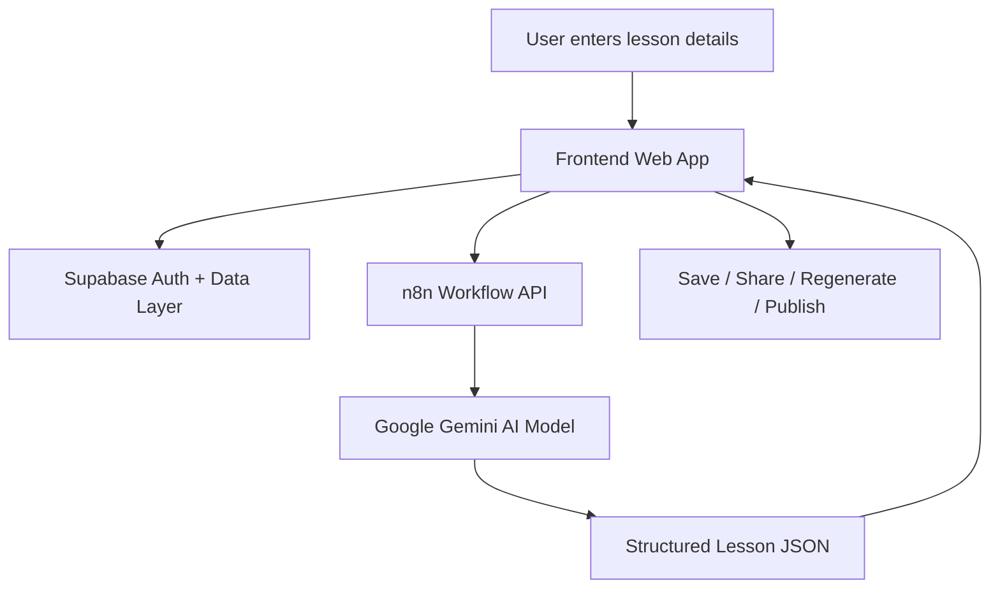
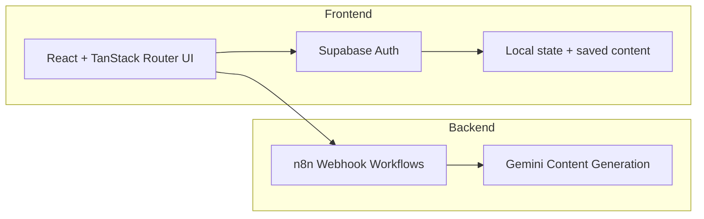
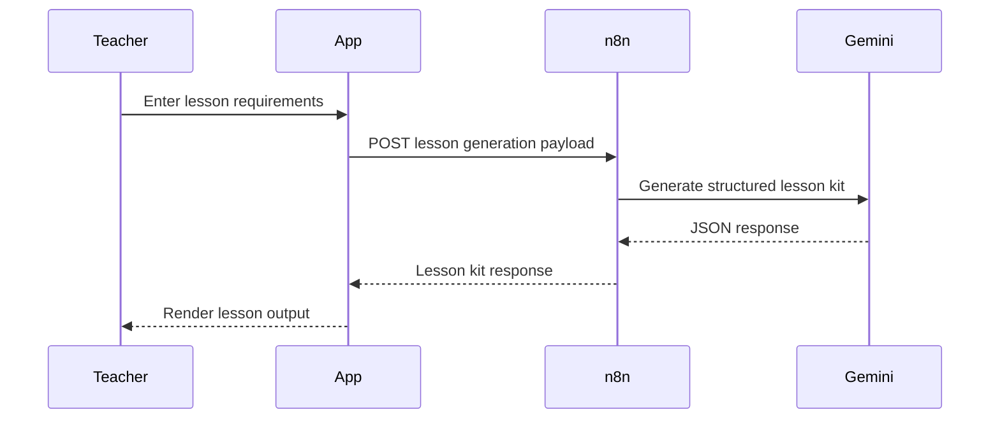

# ✨ AI Teaching Studio

## 🚀 Project Title
**AI Teaching Studio** — an AI-powered lesson generation SaaS for teachers, students, and curriculum teams.

---

## 🧠 Product Overview
AI Teaching Studio helps educators create classroom-ready lesson kits in seconds. Users can generate structured lesson plans, worksheets, quizzes, answer keys, and rubrics using AI, then save, share, and regenerate individual sections as needed.

This project is designed as a **public AI SaaS portfolio showcase** with a polished UI, production-ready developer experience, and modular architecture that can scale from prototype to production.

---

## 🎯 Problem Solved
Teachers often spend significant time building lesson content from scratch. Common pain points include:

- Manual creation of lesson plans, worksheets, and quizzes
- Inconsistent quality and pedagogy alignment
- Time spent formatting, grading, and regenerating content
- Limited reuse of high-quality teaching assets

AI Teaching Studio solves this by turning a simple prompt into a **complete, curriculum-aligned lesson kit** with built-in export, storage, and regeneration workflows.

---

## 🏗️ Solution Architecture

### High-Level Flow



### System Components



### Architectural Notes
- **Frontend:** React + TanStack Start + TypeScript + Tailwind CSS
- **Auth + Storage:** Supabase
- **AI orchestration:** n8n workflows for lesson generation and section regeneration
- **Model provider:** Google Gemini (via n8n credential configuration)
- **Deployment target:** Cloudflare Pages / Workers-compatible frontend

---

## ✨ Features

### Core Features
- ✨ **Instant lesson kit generation** for subject, grade, topic, duration, and objectives
- 📘 **Structured outputs** for lesson plans, worksheets, quizzes, answer keys, and rubrics
- 🔄 **Regenerate specific sections** without rebuilding the full lesson
- 🔐 **Authentication & role-aware flows** for teachers and students
- 💾 **Saved lessons & library view** for reusable content
- 📤 **Shareable lesson links** for collaboration
- 🌐 **Multi-language support** for English, Hindi, Tamil, Telugu, Kannada, and Marathi
- 🎨 **Modern, portfolio-grade UI** with polished cards, gradients, and responsive layout

### Additional Product Value
- 🧠 **Pedagogy-aware prompt engineering** for age-appropriate output
- 📋 **Teacher-friendly answer key controls** with hidden or revealed answers
- 📝 **Readable, structured JSON output** that powers the UI cleanly
- 🚀 **Cloud-ready deployment patterns** for public demo and production use

---

## 🔄 Workflow Explanation

1. **Teacher enters lesson details** such as subject, grade, topic, duration, and learning objectives.
2. The frontend sends the request to the **n8n webhook**.
3. n8n calls **Google Gemini** with a structured prompt.
4. The AI returns a JSON payload containing the lesson plan, worksheet, quiz, rubric, and answer key.
5. The frontend renders the results into interactive sections.
6. The user can **save**, **share**, or **regenerate** any section individually.
7. Teachers can revisit saved lessons from the library panel.

### Example User Journey



---

## 🛠️ Tech Stack

### Frontend
- React 19
- TypeScript
- TanStack Router + TanStack Start
- Tailwind CSS
- Radix UI primitives
- Lucide Icons
- Vite

### Backend / AI
- n8n workflows
- Google Gemini / PaLM-based generation

### Data & Auth
- Supabase Auth
- Supabase client SDK

### Deployment
- Cloudflare Pages / Workers-compatible deploy
- Vite build pipeline

---

## 📦 Installation Steps

### 1. Clone the repository

```bash
git clone https://github.com/YOUR_USERNAME/AI-Teaching-Studio.git
cd AI-Teaching-Studio
```

### 2. Install dependencies

```bash
cd Frontend
npm install
```

### 3. Create environment file

```bash
cp .env.example .env.local
```

### 4. Configure environment variables

Update `.env.local` with your values:

```env
VITE_SUPABASE_URL=https://YOUR_PROJECT_ID.supabase.co
VITE_SUPABASE_ANON_KEY=your-supabase-anon-key
VITE_N8N_GENERATE_URL=https://YOUR_N8N_HOST/webhook/generate-lesson
VITE_N8N_REGEN_URL=https://YOUR_N8N_HOST/webhook/regenerate-section
```

### 5. Run locally

```bash
npm run dev
```

### 6. Build for production

```bash
npm run build
```

---

## 🔐 Environment Variables

| Variable | Purpose | Required | Example |
| --- | --- | --- | --- |
| `VITE_SUPABASE_URL` | Supabase project URL | ✅ | `https://your-project.supabase.co` |
| `VITE_SUPABASE_ANON_KEY` | Public Supabase anon key | ✅ | `your-supabase-anon-key` |
| `VITE_N8N_GENERATE_URL` | n8n webhook for lesson generation | ✅ | `https://your-n8n-host/webhook/generate-lesson` |
| `VITE_N8N_REGEN_URL` | n8n webhook for section regeneration | ✅ | `https://your-n8n-host/webhook/regenerate-section` |

> 📝 Note: Your AI provider credentials are configured inside the n8n workflow, not in the frontend environment file.

---

## 📸 Screenshots

### Teacher Generate View


### Teacher Library View


### Create Account View


### Project Explainer Images

#### Project Explainer Image 1


#### Project Explainer Image 2


---

## 🚀 Deployment Links

- 🌐 **Live Demo:** `https://your-app-domain.com`
- ☁️ **Cloudflare Pages / Workers Deployment:** `https://your-project-name.pages.dev`
- 🔧 **n8n Workflow Dashboard:** `https://your-n8n-host`
- 🧪 **Staging Environment:** `https://staging.your-app-domain.com`

### Suggested Deployment Commands

```bash
npm run build
npx wrangler deploy
```

---

## 🛣️ Future Roadmap

### Near-Term
- 📊 Add analytics for lesson usage and engagement
- 🌍 Expand multi-language translation quality and localization
- 🧪 Improve quiz generation with harder difficulty controls

### Mid-Term
- 👩‍🎓 Student dashboard for assignments and progress tracking
- 🧾 Export to PDF and Word formats
- 🧩 App embedding and classroom integration partners

### Long-Term
- 🤖 Personalized lesson recommendations based on grade and curriculum history
- 👥 Team collaboration and shared curriculum libraries
- 🔍 Content moderation and role-based permissions for enterprise use

---

## 👤 Creator Information

- **Project Name:** AI Teaching Studio
- **Creator:** Awanish Srivastav
- **GitHub:** `https://github.com/awanishsrivastab`
- **Email:** `awanish.srivastab@gmail.com`

> Replace the placeholder creator details with your real portfolio links and contact information.

---

## 📄 License

This project is licensed under the **MIT License**.

```text
MIT License

Copyright (c) 2026 Your Name

Permission is hereby granted, free of charge, to any person obtaining a copy
of this software and associated documentation files (the "Software"), to deal
in the Software without restriction, including without limitation the rights
to use, copy, modify, merge, publish, distribute, sublicense, and/or sell
copies of the Software, and to permit persons to whom the Software is furnished
to do so, subject to the following conditions:

The above copyright notice and this permission notice shall be included in all
copies or substantial portions of the Software.

THE SOFTWARE IS PROVIDED "AS IS", WITHOUT WARRANTY OF ANY KIND, EXPRESS OR
IMPLIED, INCLUDING BUT NOT LIMITED TO THE WARRANTIES OF MERCHANTABILITY,
FITNESS FOR A PARTICULAR PURPOSE AND NONINFRINGEMENT. IN NO EVENT SHALL THE
AUTHORS OR COPYRIGHT HOLDERS BE LIABLE FOR ANY CLAIM, DAMAGES OR OTHER
LIABILITY, WHETHER IN AN ACTION OF CONTRACT, TORT OR OTHERWISE, ARISING FROM,
OUT OF OR IN CONNECTION WITH THE SOFTWARE OR THE USE OR OTHER DEALINGS IN THE
SOFTWARE.
```

---

## 💡 Portfolio Notes

AI Teaching Studio is structured to look like a **real AI product**, not just a demo. It combines a clean product story, a practical workflow, deployment-ready infrastructure, and strong visual presentation suitable for hiring managers, investors, and collaborators.
